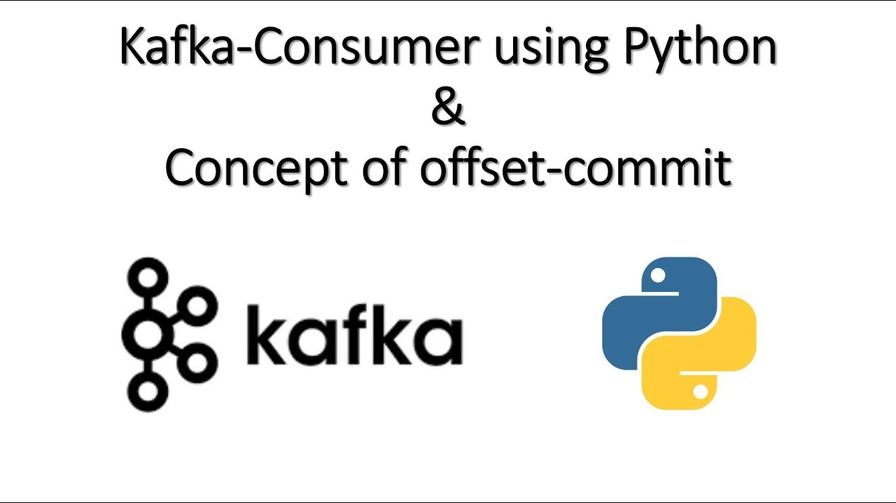
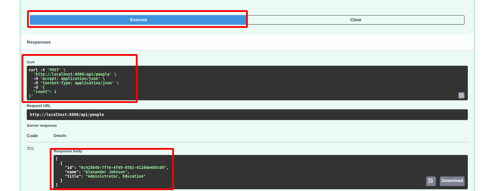
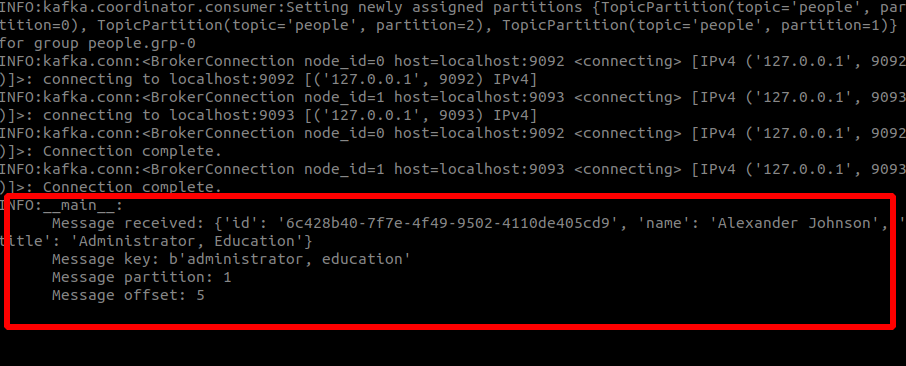

# Kafka Consumers with Python
This is a simple example of how to use Kafka consumers with Python.


## Prerequisites
1. kafka-installtions-and-kafka-topics: https://medium.com/dev-genius/kafka-installtions-and-kafka-topics-f0b7c81754d8
2. kafka-with-python-fast-api: https://medium.com/dev-genius/kafka-with-python-fast-api-b1622eb7f9d0
3. kafka-with-python-Producer: https://medium.com/dev-genius/producing-message-to-kafka-using-cli-6bd22fc51d5c


Lets first start the Zookeeper and Kafka server. You can use the following commands to start the Zookeeper and Kafka server.

```bash
docker-compose up -d
```

## See the list of topics
see the list of topics using the following command. If you dont have topics than you have to create one.

```bash
docker exec -it cli-tools kafka-topics --list --bootstrap-server broker0:29092,broker1:29093,broker2:29094
```

## Create a topic
Create a topic using the following command.

```bash
docker exec -it cli-tools kafka-topics --create --topic people --bootstrap-server broker0:29092 --partitions 2
```

## Creating Python Producer
Create a python producer using the following command.

kafka-with-python-Producer: https://medium.com/dev-genius/producing-message-to-kafka-using-cli-6bd22fc51d5c

[OR]
Use this git to make kafka producer
https://github.com/SohaibAnwaar/Produce-Messages-To-Kafka

## Creating Python Consumer
We are going to write a python consumer to consume the messages from the topic we created in the previous step.

### Create .env file
```bash
BOOTSTRAP_SERVER="localhost:9092"
TOPICS_PEOPLE_BASIC_NAME="people"
CONSUMER_GROUP="people.grp-0"
```


### Create a python file

Create file ```consumer.py```

Import the following libraries
```python
import logging
import os
import json

from dotenv import load_dotenv
from kafka.consumer import KafkaConsumer

load_dotenv(verbose=True)
logging.basicConfig(level=logging.INFO)
logger = logging.getLogger(__name__)
```

Create a consumer class
```python
def main():
  print("Starting consumer", os.environ["BOOTSTRAP_SERVER"])
  consumer = KafkaConsumer( 
    bootstrap_servers=[os.environ["BOOTSTRAP_SERVER"]],
    auto_offset_reset="earliest",
    enable_auto_commit=True,
    group_id=os.environ["CONSUMER_GROUP"],
    key_deserializer=lambda x: json.loads(x.decode("utf-8")),
    value_deserializer=lambda x: json.loads(x.decode("utf-8"))
  )

  consumer.subscribe([os.environ["TOPICS_PEOPLE_BASIC_NAME"]])

  for message in consumer:
    message = f"""
    Message received: {message.value}
    Message key: {message.key}
    Message partition: {message.partition}
    Message offset: {message.offset}

    """
    logger.info(message)

  pass

if __name__ == "__main__":
  main()
```

Now Lets run the consumer using the following command.

```bash
python consumer.py
```

now you can send messages from the producer and see the messages in the consumer.

## Produce Message from Producer

Follow the following link to produce messages from the producer.
https://medium.com/dev-genius/producing-message-to-kafka-using-cli-6bd22fc51d5c



## Consume Message from Consumer




## Check out the code on GitHub:
https://github.com/SohaibAnwaar/Kafka-Consumer-Python

# Author 
* Sohaib Anwaar  : https://www.sohaibanwaar.com
* gmail          : sohaibanwaar36@gmail.com
* linkedin       : [Have Some Professional Talk here](https://www.linkedin.com/in/sohaib-anwaar-4b7ba1187/)
* Stack Overflow : [Get my help Here](https://stackoverflow.com/users/7959545/sohaib-anwaar)
* Kaggle         : [View my master-pieces here](https://www.kaggle.com/sohaibanwaar1203)
* Github         : [View my code here](https://github.com/SohaibAnwaar)